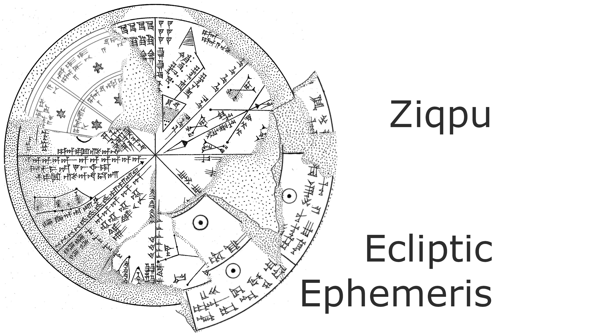

I've scaled, rotated, cut, and reflected three figures from a peer reviewed paper to make the cuneiform tablet sketchy logo above:

Logo Source Acknowledgment
Hand-drawn reproductions based on Figures 1–3 from:
Monroe, M. Willis (2022). Astronomical and astrological diagrams from cuneiform sources. Journal for the History of Astronomy, 53(4), 367–396.
<https://doi.org/10.1177/00218286221110919>

- [PDF](monroe2022/monroe-2022-astronomical-and-astrological-diagrams-from-cuneiform-sources.pdf)
- Images [k14943](monroe2022/k14943.jpg) [k8538](monroe2022/k8538.jpg) [sm162](monroe2022/sm162.jpg)

Original images from British Museum tablets: CT 33, plates 10–12 (Sm. 162, K.14943+, K.8538).
